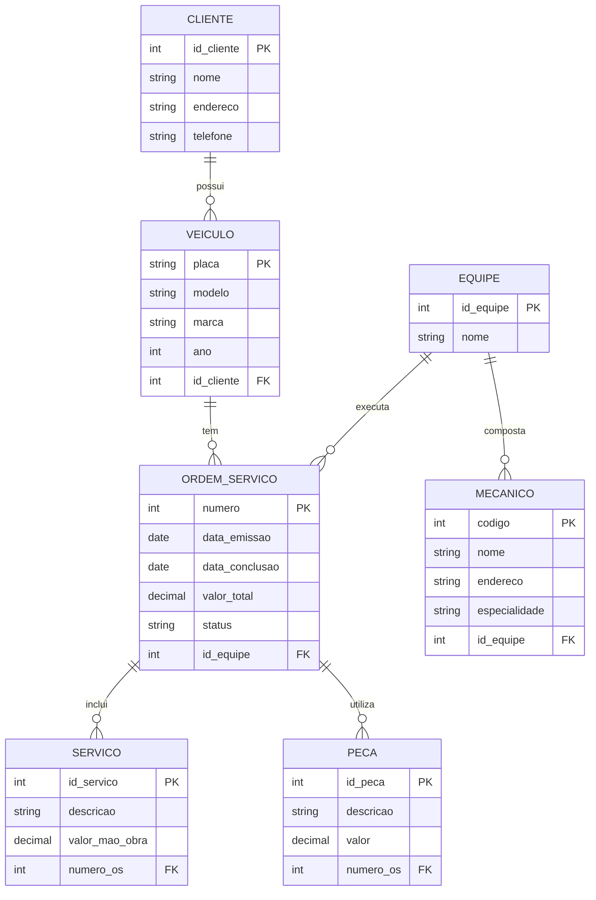

# Sistema de Gerenciamento de Oficina Mecânica

## Descrição do Projeto
Sistema desenvolvido para controle e gerenciamento de execução de ordens de serviço em uma oficina mecânica. O sistema permite o acompanhamento completo desde a entrada do veículo até a conclusão dos serviços.

## Modelagem do Sistema

### Contexto
O sistema foi modelado considerando o seguinte fluxo de negócio:
- Clientes trazem veículos para conserto ou revisões periódicas
- Veículos são designados a equipes de mecânicos
- Equipes identificam serviços necessários e geram Ordens de Serviço (OS)
- Sistema calcula valores com base em tabela de mão-de-obra e peças
- Cliente autoriza execução
- Equipe realiza os serviços

### Modelo Conceitual
O diagrama abaixo representa o modelo conceitual do sistema:

## Entidades Principais

### Cliente
- Cadastro de clientes da oficina
- Relacionamento com seus veículos

### Veículo
- Registro dos veículos que são atendidos
- Vinculado a um cliente
- Base para abertura de ordens de serviço

### Ordem de Serviço (OS)
- Documento principal do sistema
- Registra serviços a serem executados
- Controla prazos e valores
- Mantém status do serviço

### Equipe e Mecânicos
- Organização dos profissionais em equipes
- Registro de especialidades
- Responsáveis pela execução dos serviços

### Serviços e Peças
- Catálogo de serviços com valores de mão-de-obra
- Registro de peças utilizadas
- Composição do valor total da OS

## Como Contribuir
1. Faça um fork do projeto
2. Crie uma branch para sua feature (`git checkout -b feature/AmazingFeature`)
3. Commit suas mudanças (`git commit -m 'Add some AmazingFeature'`)
4. Push para a branch (`git push origin feature/AmazingFeature`)
5. Abra um Pull Request

## Status do Projeto
🚧 Em desenvolvimento 
