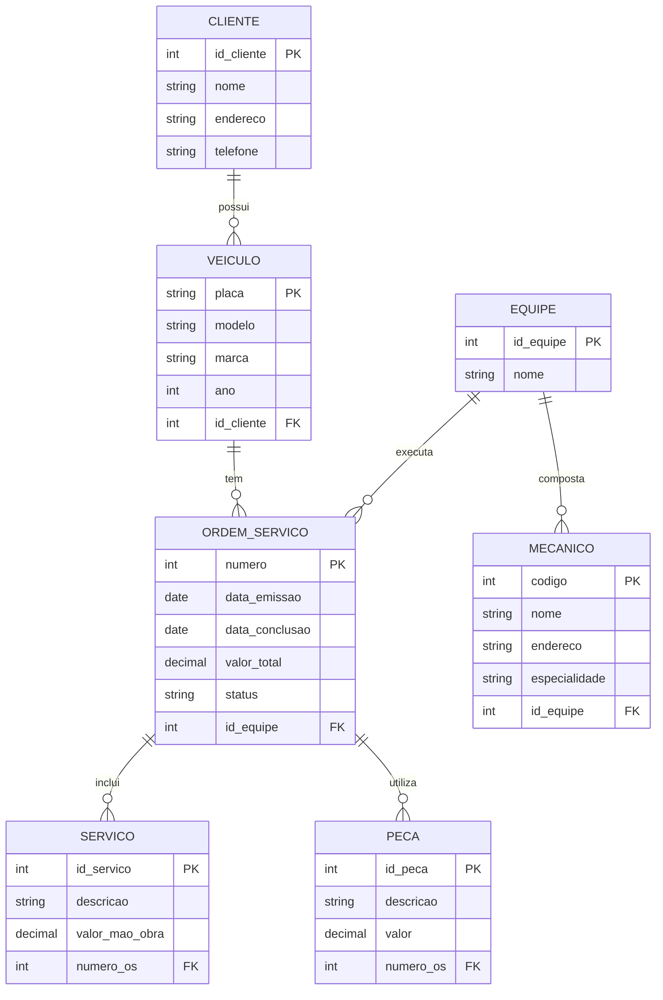

```mermaid
erDiagram
    CLIENTE ||--o{ VEICULO : possui
    VEICULO ||--o{ ORDEM_SERVICO : "tem"
    ORDEM_SERVICO ||--o{ SERVICO : inclui
    ORDEM_SERVICO ||--o{ PECA : utiliza
    EQUIPE ||--o{ MECANICO : composta
    EQUIPE ||--o{ ORDEM_SERVICO : "executa"

    CLIENTE {
        int id_cliente PK
        string nome
        string endereco
        string telefone
    }

    VEICULO {
        string placa PK
        string modelo
        string marca
        int ano
        int id_cliente FK
    }

    ORDEM_SERVICO {
        int numero PK
        date data_emissao
        date data_conclusao
        decimal valor_total
        string status
        int id_equipe FK
    }

    SERVICO {
        int id_servico PK
        string descricao
        decimal valor_mao_obra
        int numero_os FK
    }

    PECA {
        int id_peca PK
        string descricao
        decimal valor
        int numero_os FK
    }

    EQUIPE {
        int id_equipe PK
        string nome
    }

    MECANICO {
        int codigo PK
        string nome
        string endereco
        string especialidade
        int id_equipe FK
    }
```
