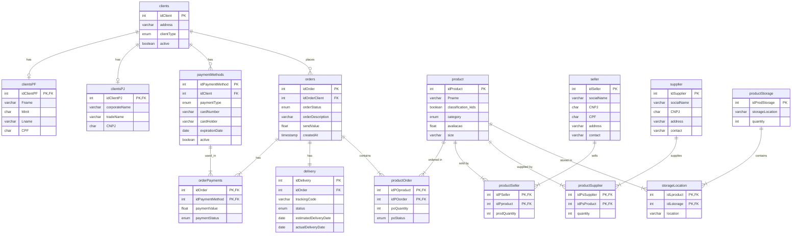

# E-commerce Database Documentation

## Visão Geral
Este projeto implementa um schema de banco de dados MySQL para uma plataforma de e-commerce. O sistema suporta múltiplos tipos de usuários (clientes PF/PJ, fornecedores e vendedores), gestão de produtos, pedidos, pagamentos e entregas.

## Diagrama do Banco de Dados

### Legenda do Diagrama
- **PK**: Chave Primária
- **FK**: Chave Estrangeira
- **||--||**: Relação um-para-um
- **||--|{**: Relação um-para-muitos
- **}|--|{**: Relação muitos-para-muitos

## Estrutura do Banco de Dados

### Clientes
- **Separação PF/PJ**: 
  - Tabela base `clients` com informações comuns
  - Tabela `clientsPF` para Pessoa Física (CPF)
  - Tabela `clientsPJ` para Pessoa Jurídica (CNPJ)
  - Sistema de constraint que impede duplo cadastro

### Produtos e Estoque
- **Produtos**: Cadastro base de produtos com categorias e classificações
- **Estoque**: 
  - Controle de localização física dos produtos
  - Gestão de quantidade disponível
  - Relacionamento com fornecedores e vendedores

### Vendedores e Fornecedores
- **Vendedores**: 
  - Suporte a vendedores PF ou PJ
  - Constraint que garante apenas um tipo de documento (CPF ou CNPJ)
  - Controle de produtos por vendedor
- **Fornecedores**:
  - Cadastro de fornecedores com CNPJ
  - Gestão de produtos fornecidos
  - Controle de quantidade fornecida

### Pedidos e Pagamentos
- **Pedidos**: 
  - Status do pedido com múltiplos estados
  - Valor de envio
  - Descrição e tracking
- **Pagamentos**:
  - Múltiplas formas de pagamento por cliente
  - Suporte a diversos métodos (Cartão, Boleto, PIX)
  - Controle de status do pagamento
  - Possibilidade de pagamento dividido

### Entregas
- Sistema de rastreamento com:
  - Código de rastreio único
  - Status da entrega
  - Datas estimada e real
  - Estados de entrega atualizáveis

## Relacionamentos Principais

1. **Produtos e Vendedores**:
   - Relação N:M através da tabela `productSeller`
   - Controle de quantidade por vendedor

2. **Produtos e Fornecedores**:
   - Relação N:M através da tabela `productSupplier`
   - Gestão de quantidade fornecida

3. **Produtos e Pedidos**:
   - Relação N:M através da tabela `productOrder`
   - Controle de quantidade e disponibilidade

4. **Produtos e Estoque**:
   - Relação N:M através da tabela `storageLocation`
   - Gestão de localização física

## Melhorias Implementadas

1. **Segurança de Dados**:
   - Constraints para documentos únicos
   - Validações de tipos de dados
   - Checks para regras de negócio

2. **Rastreabilidade**:
   - Timestamps em operações críticas
   - Status detalhados para pedidos e entregas
   - Histórico de pagamentos

3. **Flexibilidade**:
   - Suporte a múltiplos métodos de pagamento
   - Diversos status de pedido e entrega
   - Categorização flexível de produtos

## Considerações Técnicas

### Tipos de Dados
- Uso de CHAR para documentos com tamanho fixo (CPF, CNPJ)
- VARCHAR para campos de tamanho variável
- ENUM para campos com valores predefinidos
- Timestamps para controle temporal

### Constraints
- Chaves estrangeiras para integridade referencial
- Unique constraints para campos únicos
- Check constraints para regras de negócio
- Default values para campos opcionais

### Indexação
- Primary keys otimizadas
- Foreign keys indexadas
- Campos de busca frequente com índices

## Como Usar

1. Execute o script de criação do banco de dados
2. Verifique se todas as tabelas foram criadas corretamente
3. Realize as configurações de conexão necessárias
4. Implemente as regras de negócio na aplicação

## Manutenção e Atualizações

Para futuras atualizações, considere:
- Backup regular dos dados
- Verificação de integridade referencial
- Monitoramento de performance
- Atualização de índices conforme necessário